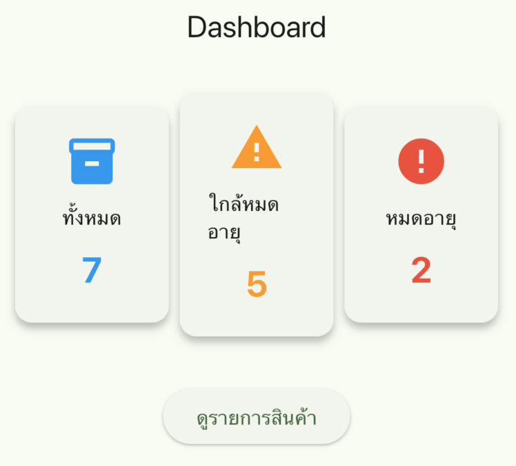
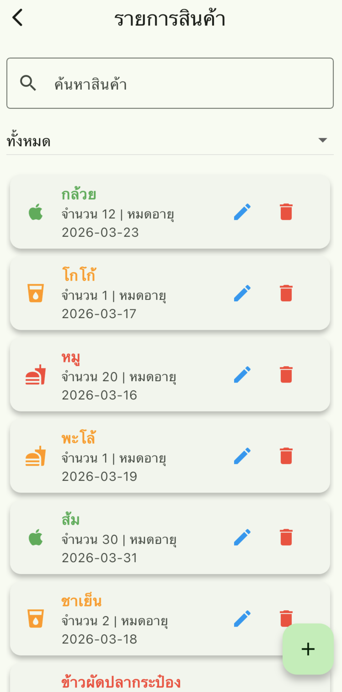
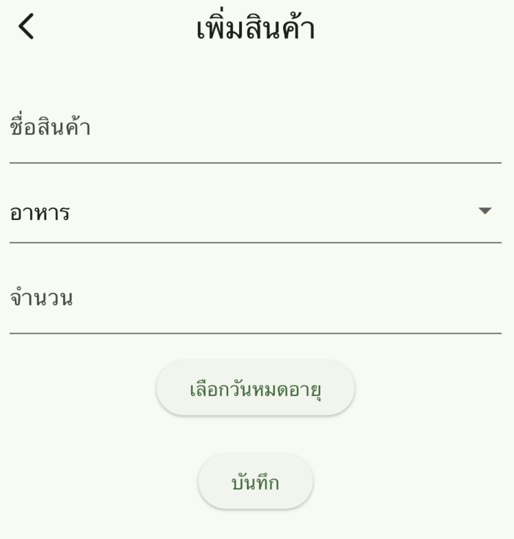
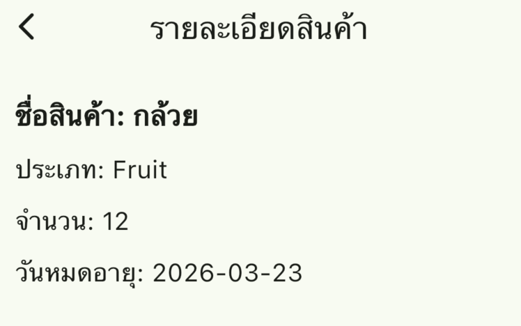

# แอปบันทึกสินค้าในตู้เย็น (Fridge Inventory App)

## ผู้จัดทำ

ชื่อ: นันทวัฒน์ แซ่ย่าง
รหัสนักศึกษา: 67543210034-4

---

# รายละเอียดระบบ

แอปพลิเคชันสำหรับบันทึกรายการอาหารหรือสินค้าที่เก็บไว้ในตู้เย็น ผู้ใช้สามารถเพิ่ม แก้ไข ลบ และดูรายละเอียดสินค้าได้ พร้อมทั้งสามารถตรวจสอบวันหมดอายุของสินค้า เพื่อช่วยลดการลืมอาหารที่เก็บไว้ในตู้เย็น

ระบบถูกพัฒนาด้วย **Flutter Framework** และใช้ **SQLite** เป็นฐานข้อมูลภายในเครื่อง พร้อมใช้ **Provider** สำหรับจัดการ State ของแอปพลิเคชัน

---

# ฟังก์ชันหลักของระบบ

### 1. แสดงรายการสินค้า (List Screen)

ระบบจะแสดงรายการสินค้าทั้งหมดที่ถูกบันทึกไว้ในฐานข้อมูล โดยแสดงข้อมูลดังนี้

* ชื่อสินค้า
* ประเภทสินค้า
* จำนวน
* วันหมดอายุ

---

### 2. เพิ่มสินค้า (Create)

ผู้ใช้สามารถเพิ่มสินค้าใหม่ได้ โดยกรอกข้อมูลดังนี้

* ชื่อสินค้า
* ประเภทสินค้า
* จำนวนสินค้า
* วันหมดอายุ

ข้อมูลจะถูกบันทึกลงในฐานข้อมูล SQLite

---

### 3. แก้ไขสินค้า (Update)

ผู้ใช้สามารถแก้ไขข้อมูลสินค้าที่บันทึกไว้ได้ เช่น

* แก้ไขชื่อสินค้า
* เปลี่ยนประเภทสินค้า
* แก้ไขจำนวนสินค้า
* เปลี่ยนวันหมดอายุ

---

### 4. ลบสินค้า (Delete)

ผู้ใช้สามารถลบรายการสินค้าออกจากระบบได้ โดยระบบจะมี **Dialog ยืนยันการลบ** เพื่อป้องกันการลบโดยไม่ได้ตั้งใจ

---

### 5. ดูรายละเอียดสินค้า (Detail Screen)

ผู้ใช้สามารถกดดูรายละเอียดของสินค้าแต่ละรายการ เพื่อดูข้อมูลทั้งหมดของสินค้านั้น

---

### 6. ค้นหาสินค้า (Search)

ผู้ใช้สามารถค้นหาสินค้าจาก **ชื่อสินค้า** โดยพิมพ์คำค้นหาในช่องค้นหา ระบบจะแสดงเฉพาะรายการที่ตรงกับคำค้นหา

---

### 7. กรองตามประเภทสินค้า (Filter)

ผู้ใช้สามารถเลือกแสดงสินค้าเฉพาะประเภท เช่น

* อาหาร
* เครื่องดื่ม
* ผลไม้
* ทั้งหมด

---

### 8. Dashboard แสดงสถิติ

ระบบมีหน้า Dashboard สำหรับสรุปข้อมูลสินค้าในตู้เย็น ได้แก่

* จำนวนสินค้าทั้งหมด
* จำนวนสินค้าใกล้หมดอายุ
* จำนวนสินค้าที่หมดอายุแล้ว

---

# เทคโนโลยีที่ใช้

* Flutter
* Dart
* Provider (State Management)
* SQLite (sqflite package)
* Material 3 UI

---

# โครงสร้างโปรเจค

```
lib
│
├── main.dart
│
├── models
│   └── item.dart
│
├── providers
│   └── item_provider.dart
│
├── services
│   └── database_helper.dart
│
├── screens
│   ├── dashboard_screen.dart
│   ├── item_list_screen.dart
│   ├── add_edit_item_screen.dart
│   └── item_detail_screen.dart
│
├── widgets
│   ├── item_card.dart
│   └── dashboard_card.dart
│
└── utils
    ├── theme.dart
    └── constants.dart
```

---

# โครงสร้างฐานข้อมูล (Database)

Table: **items**

| Field      | Type    | Description  |
| ---------- | ------- | ------------ |
| id         | INTEGER | Primary Key  |
| name       | TEXT    | ชื่อสินค้า   |
| category   | TEXT    | ประเภทสินค้า |
| quantity   | INTEGER | จำนวน        |
| expiryDate | TEXT    | วันหมดอายุ   |

---

# วิธีการติดตั้งและรันโปรเจค

1. Clone Repository

```

git clone <repository-url>
```

2. เข้าโฟลเดอร์โปรเจค

```
cd fridge_inventory_app
```

3. ติดตั้ง dependencies

```
flutter pub get
```

4. รันแอป

```
flutter run
```

---

# ตัวอย่างหน้าจอการทำงาน (Screenshots)

## Screenshots

### Dashboard


### รายการสินค้า


### เพิ่มสินค้า


### รายละเอียดสินค้า


---

# สรุป

แอปพลิเคชันนี้ช่วยให้ผู้ใช้สามารถจัดการสินค้าในตู้เย็นได้อย่างสะดวก ลดปัญหาการลืมอาหารที่เก็บไว้ในตู้เย็น และสามารถตรวจสอบวันหมดอายุของสินค้าได้อย่างง่ายดาย
